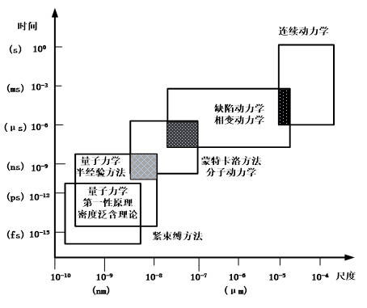
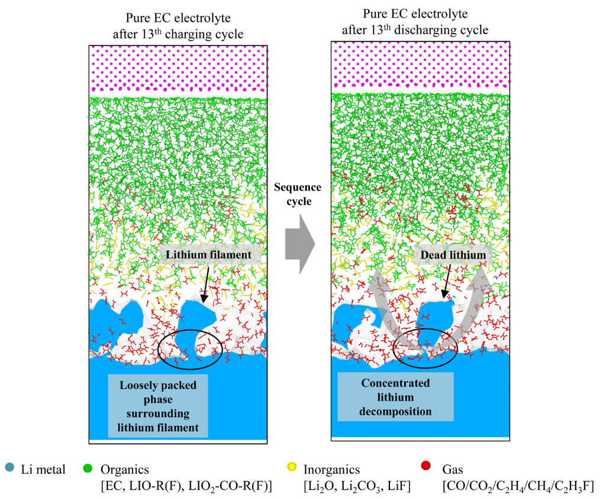
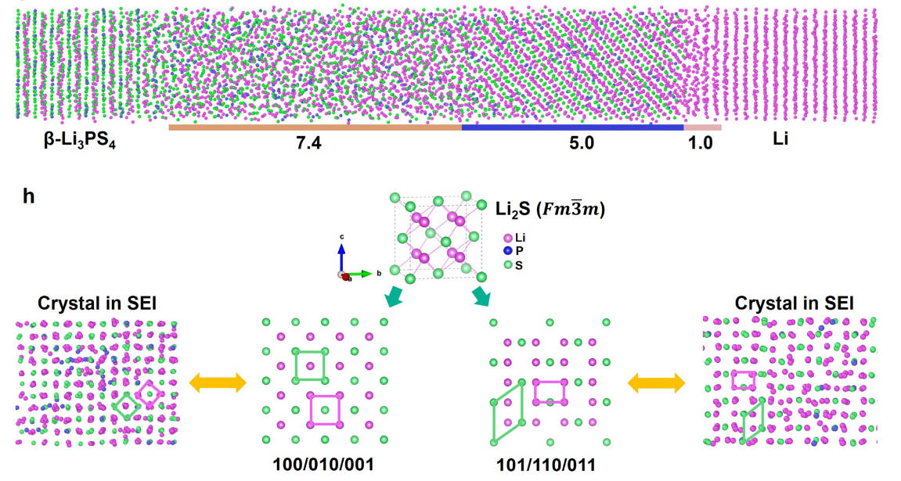

# 第三章 计算材料学基础导读

> **适用对象**：AI4Bat 项目本科生科研新生  
> **目标**：建立计算材料学知识框架，理解从第一性原理到机器学习势的核心方法，掌握主流软件入门路径  
> **推荐阅读**：
> - 江建军 等，《计算材料学：设计实践方法》（第二版），高等教育出版社   
> **推荐视频**：[《2024秋—计算材料学》（华中科技大学 单斌 教授）](https://www.bilibili.com/video/BV1DWeseAE7k)

---

## 3.1 计算材料学体系概述

计算材料学（Computational Materials Science）是一门**融合材料科学、量子力学、统计物理与计算机科学**的交叉学科，旨在通过**多尺度模拟方法**预测材料结构、性能与演化行为，从而**加速新材料设计与机理理解**。

### 3.1.1 多尺度模拟框架

计算方法按空间与时间尺度可分为：

| 方法 | 空间尺度 | 时间尺度 | 核心物理 | 典型应用 |
|------|--------|--------|--------|--------|
| **第一性原理**（ab initio） | Å – nm | fs – ps | 量子力学（薛定谔方程） | 电子结构、反应能垒、缺陷形成能 |
| **分子动力学**（MD） | nm – μm | ps – ns | 经典牛顿力学 | 扩散、相变、力学响应 |
| **蒙特卡罗**（MC） | nm – μm | — | 统计采样 | 吸附、合金有序化 |
| **相场/有限元** | μm – mm | ms – s | 连续介质理论 | 枝晶生长、裂纹扩展 |

> 💡 **核心思想**：**“从电子到器件”**（From electrons to devices）  
> 不同尺度方法可**嵌套耦合**（如 DFT → 力场参数化 → MD → 相场）

   
  <em>图 3.1：计算材料学多尺度模拟体系示意图</em>

---

## 3.2 第一性原理方法概述

第一性原理（ab initio）方法**不依赖经验参数**，仅基于原子序数和基本物理常数求解多电子体系薛定谔方程。

### 3.2.1 哈特里-福克方法（Hartree-Fock, HF）

HF 方法将多电子波函数近似为**单斯莱特行列式**，通过变分法求解：

$$
\hat{H} \Psi = E \Psi, \quad \Psi = \frac{1}{\sqrt{N!}} \det \left| \phi_1 \phi_2 \cdots \phi_N \right|
$$

- **优点**：包含交换作用（Pauli 不相容）
- **缺点**：**忽略电子关联能**（correlation energy），对金属、强关联体系误差大

### 3.2.2 密度泛函理论（Density Functional Theory, DFT）

DFT 基于 **Hohenberg-Kohn 定理**，将多电子问题转化为**电子密度泛函极小化**问题：

$$
E[\rho] = T_s[\rho] + E_{\text{ext}}[\rho] + E_{\text{H}}[\rho] + E_{\text{xc}}[\rho]
$$

其中 $E_{\text{xc}}[\rho]$ 为**交换关联泛函**，需近似处理：

| 泛函类型 | 代表 | 精度 | 计算成本 |
|--------|------|------|--------|
| LDA | 局域密度近似 | 低（晶格常数偏小） | ★☆☆ |
| GGA | PBE, PW91 | 中（常用） | ★★☆ |
| meta-GGA | SCAN | 较高 | ★★★ |
| 杂化泛函 | HSE06 | 高（带隙准确） | ★★★★ |

> ✅ **DFT 优势**：在**精度与效率间取得最佳平衡**，成为材料模拟主流方法  
> ❌ **局限**：带隙低估、强关联体系（如 NiO）描述不佳

---

## 3.3 分子动力学入门

分子动力学（Molecular Dynamics, MD）通过数值求解牛顿运动方程，模拟原子随时间的演化：

$$
m_i \frac{d^2 \mathbf{r}_i}{dt^2} = -\nabla_i U(\mathbf{r}_1, \dots, \mathbf{r}_N)
$$

其中 $U$ 为**势函数**（force field），决定模拟精度。

### 3.3.1 经典分子动力学（cMD）

- **势函数形式**：经验势（如OPLS/GAFF力场）
- **适用体系**：大体系（>10⁴ 原子）、长时间（>1 ns）
- **局限**：无法描述键断裂/形成（除非使用反应力场）

### 3.3.2 反应力场分子动力学（ReaxFF）

ReaxFF 是一种**键级依赖的反应力场**，可动态描述化学键的生成与断裂：

- 基于 DFT 数据拟合
- 适用于**电化学界面、SEI 形成、燃烧**等反应过程
- 计算成本高于 cMD，但远低于 AIMD

> 📌 **在电池研究中的应用**：
> - 电解液分解路径（ReaxFF-MD）
> - Li⁺ 在电解液中的溶剂化结构（cMD）
> - 硅负极体积膨胀（EAM-MD）

   
  <em>图 3.2：ReaxFF-MD 模拟电解液锂金属表面死锂和SEI形成过程</em>

---

## 3.4 机器学习势函数概述

传统力场精度有限，第一性原理动力学（AIMD）成本过高。**机器学习势**（Machine Learning Potentials, MLPs）旨在**兼顾 DFT 精度与 MD 效率**。

### 3.4.1 基本原理

MLP 通过机器学习模型（如神经网络、高斯过程等），学习 **原子局部环境 → 能量/力** 的映射关系：

$$
E = f_{\text{ML}}(\{\mathbf{r}_i\}), \quad \mathbf{F}_i = -\nabla_i E
$$

训练数据通常来自高精度 DFT 计算。关键在于设计**平移、旋转、排列不变的原子环境描述符**（descriptor）。

### 3.4.2 主流方法

| 方法 | 全称 / 特点 | 描述符类型 | 优势 | 代表软件 |
|------|-------------|-----------|------|--------|
| **GAP** | Gaussian Approximation Potentials | SOAP（平滑重叠原子位置） | 不确定性量化，小数据高效 | QUIP |
| **DeepMD** | Deep Potential Molecular Dynamics | 嵌入神经网络 + 原子环境 | 可扩展至百万原子，支持 LAMMPS | DeePMD-kit |
| **MTP / ACE** | Moment Tensor Potentials / Atomic Cluster Expansion | 张量基函数展开 | **精度和速度平衡SOTA** | mlip |
| **MACE** | Message Passing Neural Networks | MPNN+ACE | **通用机器学习势函数**，泛化强，精度高 | MACE |

> ✅ **优势**：
> - 精度接近 DFT（MAE < 10 meV/atom）
> - 速度比 AIMD 快 3–6 个数量级
> - 可用于纳秒级、百万原子模拟

   
  <em>图 3.3：MLPs 模拟固态电池SEI形成过程</em>

> 🔮 **AI4Bat 关联**：MLP 可用于高通量筛选 SEI 成分、预测离子电导率、模拟枝晶生长。

---

## 3.5 软件入门学习路径

| 软件 | 类型 | 适用方法 | 学习建议 |
|------|------|--------|--------|
| **ORCA** | 量子化学 | HF, DFT, post-HF | 适合小分子、团簇；输入简洁，免费学术使用 |
| **VASP / CP2K** | 固体量子力学 | DFT（周期性体系） | VASP 商业软件；CP2K 开源，支持 AIMD、QM/MM |
| **LAMMPS** | 分子动力学 | cMD, ReaxFF, MLP | 开源、模块化、脚本驱动 |

### 3.5.1 推荐学习顺序

1. **Python 基础** → 数据处理与脚本自动化（ASE/PYMATGEN）
2. **ORCA 入门** → 小分子优化、频率计算（理解 DFT 输入输出）
3. **CP2K/VASP** → 晶体结构优化、能带计算（固体体系）
4. **LAMMPS** → 气体扩散、拉伸模拟、ReaxFF（单斌课程 Ch16）
5. **DeePMD** → 训练 ML 势、长时动力学（[玻尔社区](https://www.bohrium.com/notebooks)，[DP数据和势函数库](https://www.aissquare.com/))

> 📺 **配套视频**：  
> - [单斌《计算材料学》B站合集](https://www.bilibili.com/video/BV1DWeseAE7k)  

---

## 3.6 本章小结与延伸思考

| 方法 | 核心思想 | 电池研究中的典型问题 |
|------|--------|------------------|
| DFT | 电子结构第一性原理 | SEI 成分稳定性、界面吸附能 |
| MD | 原子运动经典模拟 | Li⁺ 扩散系数、电解液润湿性 |
| MLP | 数据驱动高精度势 | 高精度界面演化、枝晶形核 |

> **思考题**：
> 1. 为什么 DFT 不能直接用于模拟 SEI 的形成过程？需要哪些辅助方法？
> 2. ReaxFF 与 DeePMD 在模拟电解液分解时各有何优劣？
> 3. 如何构建一个“DFT → MLP → MD”的工作流来研究固态电解质界面？

---

> 📚 **延伸资源**：
> - [Learn VASP: The Hard Way](https://lvaspthw.readthedocs.io/en/latest/)
> - [厦门大学程俊老师课题组Wiki](https://wiki.cheng-group.net/)
> - [VASP 手册](https://www.vasp.at/wiki/).
> - [ORCA中文手册](https://alexander-qi.github.io/2019/orcajumpstart/).
> - [LAMMPS中文站](https://lammpscnv2.vercel.app/).
> - [玻尔社区](https://www.bohrium.com/notebooks)
> - [DP数据和势函数库](https://www.aissquare.com/)
