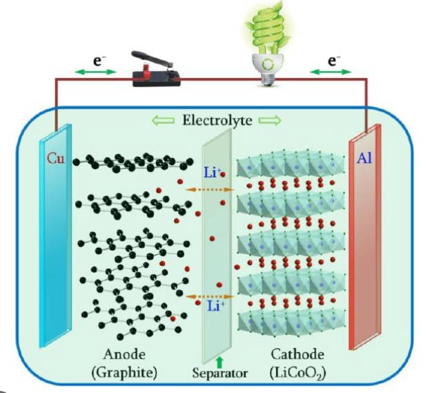
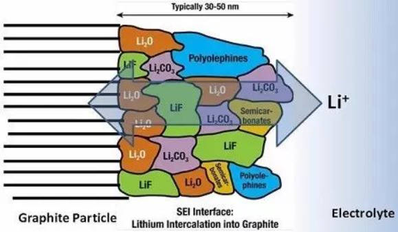
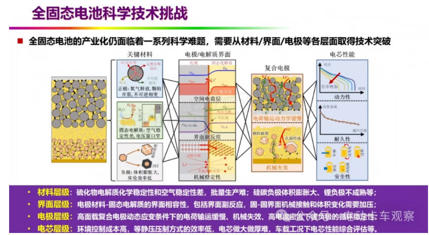

# 第二章 电池基础导读

> **适用对象**：AI4Bat 项目本科生科研新生  
> **目标**：掌握锂离子电池核心工作原理、关键界面现象与离子输运机制，了解固态电池发展趋势  
> **推荐阅读**：
> - Thomas B. Reddy 主编，汪继强等译，《电池手册》（Handbook of Batteries），化学工业出版社  
> - 査全性，《化学电源选论》，武汉大学出版社  
> - 李泓 等，《锂电池基础科学》，科学出版社  
> **推荐视频**：[《锂离子电池基础课程》（山东科技大学 刘瑞）](https://www.bilibili.com/video/BV1wh4y1871N)

---

## 2.1 电池体系概述

电池是一种将**化学能直接转化为电能**的电化学装置，其基本构成包括：

- **正极**（Cathode）：放电时发生还原反应（得电子）  
- **负极**（Anode）：放电时发生氧化反应（失电子）  
- **电解质**（Electrolyte）：传导离子，阻隔电子  
- **隔膜**（Separator）：物理隔离正负极，防止短路  
- **集流体**（Current Collector）：收集/传导电子（如 Al 箔、Cu 箔）

### 2.1.1 电池分类

| 类型 | 特点 | 代表体系 |
|------|------|--------|
| 一次电池 | 不可充电 | Zn-MnO₂（碱性电池） |
| 二次电池 | 可充电 | Li-ion, Ni-MH, Pb-acid |
| 燃料电池 | 外供燃料 | H₂/O₂ PEMFC |
| **锂离子电池** | 高能量密度、无记忆效应 | LiCoO₂/C, NMC/Si, LFP/C |

> **关键指标**：
> - **比容量**（mAh/g）：单位质量活性物质的储锂能力  
> - **能量密度**（Wh/kg 或 Wh/L）：单位质量或体积的能量  
> - **功率密度**（W/kg）：充放电速率能力  
> - **循环寿命**：容量保持率>EOL（典型值：动力电池80%，储能电池60%）的充放电次数

---

## 2.2 锂离子电池工作原理

锂离子电池通过 **Li⁺ 在正负极间的“摇椅式”嵌入/脱出** 实现充放电，电子通过外电路传输，离子通过电解质迁移。

### 2.2.1 典型反应（以石墨负极 + LiCoO₂ 正极为例）

**放电过程**（对外供电）：
- 负极：

$$
\mathrm{Li_{x}C_{6}} \rightarrow \mathrm{C_6} + x\mathrm{Li^+} + x e^-
$$

  
- 正极：

$$
\mathrm{Li_{1-x}CoO_2} + x\mathrm{Li^+} + x e^- \rightarrow \mathrm{LiCoO_2}
$$

**充电过程**：上述反应逆向进行。

> **注意**：整个过程中，**金属锂不析出**（理想情况下），Li 以离子形式在电极晶格中迁移。

### 2.2.2 电压平台与容量

- 电池电压 $V = E_{\text{cathode}} - E_{\text{anode}}$（相对于同一参比）
- 容量由**活性物质较少的一极**决定（通常为负极）

   
  <em>图 2.1：锂离子电池“摇椅式”工作原理示意图</em>

---

## 2.3 电池界面基础：固体电解质界面膜（SEI）

### 2.3.1 SEI 的形成

对于绝大多数商用锂离子电池体系（如石墨、硅基负极），**负极的工作电势**（通常 0.01–0.3 V vs. Li⁺/Li）。  
这意味着：**电解液在负极表面的还原分解在热力学上是不可避免的**。
在首次充电过程中，当负极电位降至 ~0.8 V vs. Li⁺/Li 以下时，**电解液在负极表面发生不可逆还原分解**，生成一层致密的钝化膜——**固体电解质界面膜**（Solid Electrolyte Interphase, SEI）。

典型反应（以 EC 为例）：

$$
\mathrm{EC} + 2e^- + 2\mathrm{Li^+} \rightarrow \mathrm{Li_2CO_3} + \mathrm{C_2H_4} \uparrow
$$

发生副反应，电池仍能实现长循环稳定运行，其关键在于：  
> **该分解反应是自限性**（self-limiting）

具体而言：
- 初始还原反应生成的**不溶性产物**（如 Li₂CO₃、LiF、ROCO₂Li 等）在负极表面沉积，形成一层致密的钝化膜——即 **SEI**；
- 该膜具有**电子绝缘性**，阻止电子从电极直接隧穿至电解液；
- 同时具备**Li⁺ 离子导通性**，允许 Li⁺ 穿过以参与嵌锂反应；
- 因此，后续的电解液分解速率**不再由反应极化控制，而是由扩散控制**（如溶剂分子）——这是一个**扩散控制过程**，速率随着厚度增加将持续降低。

> ✅ **SEI 的三大基本功能**：
> 1. **导离子**：允许 Li⁺ 快速迁移  
> 2. **隔电子**：阻断电子隧穿，抑制持续副反应  
> 3. **稳定界面**：适应电极体积变化，维持结构完整性

若 SEI 不具备自限性（如膜疏松、易破裂、电子导通），则电解液将持续分解，导致：
- 首次库仑效率严重损失  
- 产气（电池鼓包）  
- 循环中阻抗持续增长、容量衰减加速

### 2.3.2 SEI 的组成与性质

- **无机成分**：Li₂CO₃、LiF、Li₂O（靠近电极侧，致密）  
- **有机成分**：ROCO₂Li、ROLi（外层，多孔）  
- **理想 SEI 特性**：
  - 电子电导率 ≪ 10⁻¹⁰ S/cm  
  - Li⁺ 电导率 > 10⁻⁴ S/cm  
  - 机械强度高、弹性好

> ⚠️ **重要性**：SEI 是决定电池**首次库仑效率、循环寿命、安全性**的关键界面，尤其是在新型高比能负极（硅、锂金属）。

   
  <em>图 2.2：SEI 膜的典型多层结构示意图</em>

---

## 2.4 离子输运机制

锂离子在电池中的传输路径包括：

1. **电解液中**：液相扩散（较快）  
2. **电极材料内部**：固相扩散（通常为速率控制步骤）  
3. **固态电解质中**（如用于固态电池）：晶格/非晶态扩散

### 2.4.1 固相扩散（电极材料内）

Li⁺ 在正/负极活性材料晶格中的迁移遵循 **Fick 第二定律**：

$$
\frac{\partial c}{\partial t} = D \nabla^2 c
$$

其中 $D$ 为**化学扩散系数**（通常 10⁻¹⁴–10⁻¹⁰ cm²/s），受晶体结构、缺陷、应力等影响。

> **典型材料扩散能力**（室温）：
> - 石墨：~10⁻¹² cm²/s  
> - LiFePO₄：~10⁻¹⁴ cm²/s（一维通道，各向异性）  
> - NMC：~10⁻¹¹ cm²/s

### 2.4.2 固态电解质中的离子传导

固态电解质（SSE）需具备高 Li⁺ 电导率（>10⁻⁴ S/cm）和宽电化学窗口。

主要类型：
| 类型 | 代表材料 | 室温电导率 (S/cm) | 特点 |
|------|--------|------------------|------|
| 氧化物 | LLZO (Li₇La₃Zr₂O₁₂) | ~10⁻⁴ | 稳定，但界面阻抗大 |
| 硫化物 | LGPS (Li₁₀GeP₂S₁₂) | ~10⁻² | 高导，但对 H₂O 敏感 |
| 聚合物 | PEO-LiTFSI | ~10⁻⁵ | 柔性好，但需加热 |

离子传导机制包括：
- **空位机制**（如 LLZO）
- **间隙机制**（如 LGPS）
- **协同迁移**（如 PEO 中的链段运动）

---

## 2.5 固态电池基础

### 2.5.1 什么是固态电池？

固态电池（Solid-State Battery, SSB）指**使用固态电解质完全替代液态电解液**的锂二次电池。

### 2.5.2 优势与挑战

| 优势 | 挑战 |
|------|------|
| ✅ 高安全性（无泄漏、不易燃） | ❌ 固-固界面接触差 |
| ✅ 可兼容锂金属负极（高能量密度） | ❌ 界面副反应与阻抗高 |
| ✅ 宽温域工作潜力 | ❌ 制造成本高、工艺复杂 |

### 2.5.3 关键科学问题

1. **界面润湿性**：如何实现 SSE 与电极的紧密物理接触？
2. **空间电荷层**：因 Li⁺ 浓度梯度在正极界面形成的势垒
3. **锂枝晶穿透**：在硫化物/聚合物中仍可能发生
4. **电化学稳定性**：硫化物易氧化，卤化物易还原

> **研究前沿**：  
> - 新型固态电解质开发
> - 界面层设计  
> - 梯度复合电解质设计  
> - 原位固化策略

   
  <em>图 2.3：固态电池挑战示意图（欧阳明高院士报告）</em>

---

## 2.6 本章小结与延伸思考

| 主题 | 核心要点 |
|------|--------|
| 锂离子电池 | “摇椅式”Li⁺迁移，无金属锂参与 |
| SEI 膜 | 首次循环形成，决定寿命与效率 |
| 离子输运 | 固相扩散常为瓶颈，材料结构决定 $D$ |
| 固态电池 | 高能量密度+高安全，但界面是关键瓶颈 |

> **思考题**：
> 1. 为什么石墨负极必须形成 SEI？若无 SEI 会发生什么？
> 2. 固态电解质的离子电导率为何难以媲美液态电解液？
> 3. 如何从多尺度模拟角度研究固态电解质层的离子输运特性？

---

> 📚 **延伸资源**：
> - 李泓 视频讲座：[B站链接](https://www.bilibili.com/video/BV1zt4y1i7Tj)  
