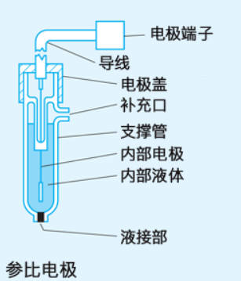
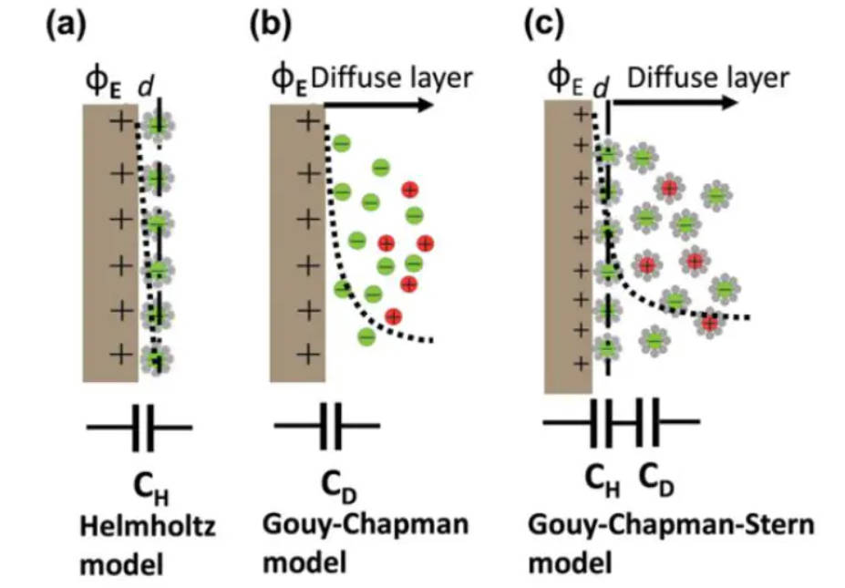
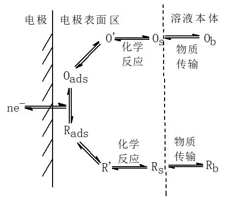

# 第一章 电化学基础导读

> **适用对象**：AI4Bat 项目本科生科研新生  
> **目标**：建立电化学基本概念框架，理解电池体系中电极/电解质界面行为与常用测试方法  
> **推荐阅读**：
> - 査全性，《电极过程动力学导论》（第三版），科学出版社  
> - A. J. Bard & L. R. Faulkner 著，邵元华等译，《电化学方法：原理与应用》（第二版），化学工业出版社  
> **推荐视频**：[浙江大学《电化学》课程（胡吉明教授）](https://www.bilibili.com/video/BV1XP411y7tL)

---

## 1.1 电化学热力学基础

### 1.1.1 化学势、电化学势与电势

在电化学体系中，带电粒子（如离子、电子）的迁移不仅受浓度梯度驱动，还受电场影响。因此，需引入 **电化学势**（electrochemical potential）来统一描述：

$$
\tilde{\mu}_i = \mu_i^\circ + RT \ln a_i + z_i F \phi
$$

其中：
- $\tilde{\mu}_i$：物种 $i$ 的电化学势  
- $\mu_i^\circ$：标准化学势  
- $a_i$：活度（近似为浓度）  
- $z_i$：电荷数  
- $F$：法拉第常数（≈ 96485 C/mol）  
- $\phi$：局部电势（单位：V）

> **关键理解**：电化学平衡要求两相间同一物种的电化学势相等，而非仅化学势相等。

### 1.1.2 相对电极电势与参比电极

*图 1.1：参比电极结构示意图

由于无法直接测量单个电极的**绝对电势**，实验中采用**相对电极电势**，即相对于某一标准参比电极的电位差。

- **标准氢电极（SHE）**：定义其电势为 0 V（25°C, 1 atm, $a_{\mathrm{H^+}} = 1$）
- 常用参比电极：Ag/AgCl、饱和甘汞电极（SCE）等

> **注意**：报告电极电位时必须注明参比体系（如“vs. Ag/AgCl”）。

### 1.1.3 能斯特方程（Nernst Equation）

对于可逆电极反应：

$$
\mathrm{Ox} + ne^- \rightleftharpoons \mathrm{Red}
$$

其平衡电极电势由 **能斯特方程** 给出：

$$
E = E^\circ - \frac{RT}{nF} \ln \frac{a_{\mathrm{Red}}}{a_{\mathrm{Ox}}}
$$

在 25°C 时简化为：

$$
E = E^\circ - \frac{0.059}{n} \log \frac{[\mathrm{Red}]}{[\mathrm{Ox}]}
$$

> **意义**：能斯特方程建立了电极电势与反应物/产物活度之间的定量关系，是电化学热力学的核心。
> **实例**：锂离子电池中，正极材料的嵌锂深度可通过开路电压（OCV）结合 Nernst 方程估算。

> **学习建议**：结合《电极过程动力学导论》第二章、《电化学方法：原理与应用》第二章和浙大视频4.x。

---

## 1.2 电极/电解质界面与双电层

电极与电解质接触时，由于电荷转移或吸附，界面处会形成 **双电层（Electrical Double Layer, EDL）**，其结构直接影响电极过程动力学。

 

*图 1.2：双电层结构示意图

### 1.2.1 双电层模型发展

- **Helmholtz 模型**（刚性平板）：认为电荷在界面两侧呈紧密排列，类似平行板电容器。
- **Gouy-Chapman 模型**：引入离子热运动，认为溶液侧电荷呈扩散分布。
- **Stern 模型**（现代常用）：结合两者，将双电层分为：
  - **内亥姆霍兹层（IHP）**：溶剂化离子或吸附物种直接接触电极
  - **外亥姆霍兹层（OHP）**：最接近电极的溶剂化离子中心
  - **扩散层**：离子浓度随距离指数衰减

> **图示建议**：参考 Bard 教材图 2.4.1 或浙大视频第 2.1 节。

### 1.2.2 零电荷电势（Potential of Zero Charge, PZC）

- 定义：当电极表面净电荷为零时所对应的电势，记作 $E_{\mathrm{zc}}$
- 物理意义：此时双电层中无静电排斥或吸引，是判断电极表面亲疏水性、吸附行为的重要参考点
- 实验测定方法：通过电容-电势曲线（ $C-\eta$ ）寻找最小值对应电位
- 应用：预测离子吸附趋势（如阴离子在 $E > E_{\mathrm{zc}}$ 时倾向于吸附）

> **重要提示**：许多电化学反应（如析氧、析氢、氧化还原）发生在双电层区域，而该区域的结构和化学环境与体相电解液存在显著差异——例如：
> - 溶剂分子取向改变
> - 离子局部浓度畸变
> - 双电层很薄（水系中<5 nm）电场强度高达 $10^8$ – $10^9$ V/m

> 因此，**双电层不仅是电荷存储场所，更是决定反应路径与速率的关键微环境**。

> **学习建议**：结合《电极过程动力学导论》第二章、《电化学方法：原理与应用》第二章和浙大视频2.1。

---

## 1.3 电极过程动力学基础

 

*图 1.3：电极/电解质界面示意图

实际电极过程往往偏离热力学平衡，需用动力学描述。典型电极反应包含多个步骤：

1. **传质**（扩散、迁移、对流）  
2. **前置转化**（如脱溶剂）  
3. **电荷转移**（电子交换）← **速控步常见于此**  
4. **后置转化**（如成核、相变）

### 1.3.1 Butler-Volmer（BV）方程

描述电荷转移步骤电流密度 $i$ 与过电位 $\eta = E - E_{\text{eq}}$ 的关系：

$$
i = i_0 \left[ \exp\left(\frac{\alpha_a nF \eta}{RT}\right) - \exp\left(-\frac{\alpha_c nF \eta}{RT}\right) \right]
$$

其中：
- $i_0$：交换电流密度（反应活性指标）
- $\alpha_a, \alpha_c$：阳极/阴极传递系数（通常 ≈ 0.5）
- $\eta$：过电位

> **极限情况**：
> - 小 $\eta$：线性区， $i \propto \eta$
> - 大 $\eta$（Tafel 区）： $\eta = a + b \log |i|$

### 1.3.2 传质控制

当反应极快时，传质（尤其是扩散）成为速率控制步骤。稳态扩散电流（如旋转圆盘电极）由 **Levich 方程** 描述；暂态扩散则遵循 **Cottrell 方程**。

> **学习建议**：结合《电极过程动力学导论》第三章/第四章、《电化学方法：原理与应用》第三章/第四章和浙大视频5.x。

---

## 1.4 常用电化学测试方法概述

### 1.4.1 循环伏安法（Cyclic Voltammetry, CV）

- **原理**：线性扫描电位并反向，记录电流响应
- **用途**：
  - 判断反应可逆性
  - 估算 $E^\circ$、 $i_0$ 、扩散系数
  - 识别中间体或副反应
- **特征**：可逆体系峰电位差 ≈ 59/n mV，峰电流 $\propto v^{1/2}$

### 1.4.2 线性扫描伏安法（Linear Sweep Voltammetry, LSV）

- CV 的单向扫描版本
- 常用于析氢（HER）、析氧（OER）等不可逆反应的起始电位与动力学分析

### 1.4.3 电化学阻抗谱（Electrochemical Impedance Spectroscopy, EIS）

> ⚠️ **重点强调**：EIS 是解析复杂电化学系统中最强大的工具之一，尤其适用于多步骤、多时间尺度过程的解耦。

- **原理**：施加小振幅正弦交流信号（通常 10 mV），测量不同频率下的阻抗响应
- **输出**：Nyquist 图（ $-Z''$ vs $Z'$ ）或 Bode 图
- **用途**：
  - 解耦界面过程（如电荷转移电阻 $R_{ct}$、双电层电容 $C_{dl}$、Warburg 扩散阻抗）
  - 构建等效电路模型拟合
- **关键点**：
  - 高频区反映双电层电容
  - 中频区对应电荷转移过程
  - 低频区体现扩散控制（Warburg 阻抗）

> **学习建议**：结合《电极过程动力学导论》4.4和第六章以及《电化学方法：原理与应用》第六章/第十章。

---

## 1.5 本章小结与延伸思考

| 概念 | 核心要点 |
|------|--------|
| 电化学势 | 带电粒子迁移的驱动力，含化学与电场贡献 |
| 能斯特方程 | 平衡电位与浓度关系 |
| 双电层 | 界面电荷分布结构，影响局部反应环境 |
| BV 方程 | 描述非平衡电极动力学 |
| CV / EIS | 最常用表征手段，分别侧重动力学与界面过程解析 |

> **思考题**：
> 1. 为什么电池充放电曲线不是能斯特方程预测的平衡电位？
> 2. 在锂离子电池中，SEI 膜如何影响双电层结构与电极动力学？
> 3. 如何从 CV 曲线判断一个反应是否受扩散控制？
> 4. 若某电极的 $E_{\mathrm{zc}}$ 位于 0.8 V vs. SHE，试推测其在 1.0 V 时对阴离子的吸附倾向？

---

> 📚 **参考资料**：
> - 查全性，《电极过程动力学导论》（第三版）
> - Bard & Faulkner，《电化学方法：原理与应用》
> - 浙大电化学课程视频：[B站链接](https://www.bilibili.com/video/BV1XP411y7tL)
